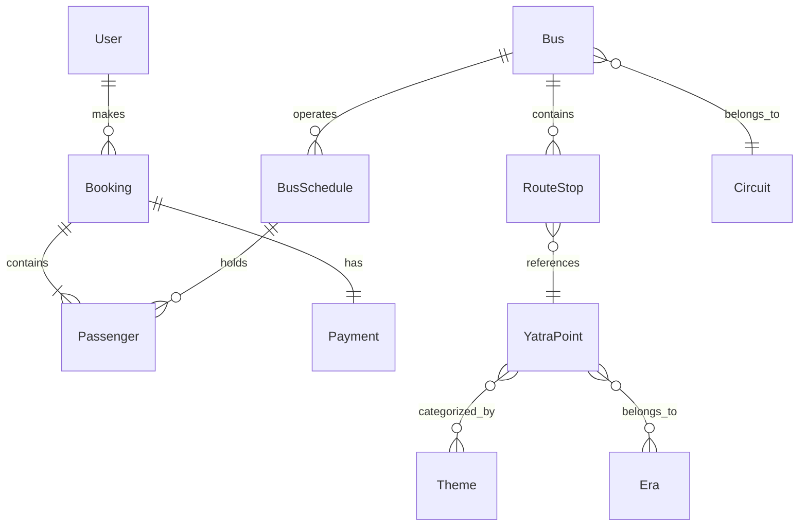

# Sarathi

### Civilizational Mobility Platform

```{=html}
<p align="center">
```
``{=html}
```{=html}
</p>
```

------------------------------------------------------------------------

# 🚀 Sarathi --- Civilizational Mobility Platform


Sarathi is a **production-grade real-time bus booking platform**
designed to model **civilizational mobility networks** connecting
heritage circuits, pilgrimage routes, and cultural destinations.

The platform demonstrates **distributed system design patterns** used in
modern booking infrastructure.

------------------------------------------------------------------------

# 🌐 Live Demo

Frontend\
https://sarathi-frontend-3zg8.onrender.com

------------------------------------------------------------------------

# 📌 Table of Contents

-   Overview
-   Key Features
-   Screenshots
-   Architecture
-   Booking Flow
-   Real-Time Seat Locking
-   Domain Model
-   Database Schema
-   API Documentation
-   Technology Stack
-   Project Structure
-   Deployment
-   Running Locally
-   License

------------------------------------------------------------------------

# 🧠 Overview

Sarathi is designed as a **heritage mobility infrastructure**.

Instead of modeling simple routes, the system represents:

    Circuit → Route → Heritage Nodes → Travelers

This enables the platform to support:

-   pilgrimage logistics
-   heritage tourism networks
-   cultural route exploration
-   real-time seat booking infrastructure

The system architecture mirrors patterns used in **high-scale booking
systems**.

------------------------------------------------------------------------

# ✨ Key Features

### 🚍 Intelligent Route Exploration

Users can explore **heritage routes and circuits** across culturally
significant locations.

### 🎟 Real-Time Seat Booking

Seats are locked using **Redis concurrency control**, preventing double
booking during payment.

### ⚡ Live Seat Updates

WebSockets broadcast seat changes to all users.

### 💳 Secure Payments

Payments are processed through **Razorpay** with server-side
verification.

### 📄 Digital Ticket Generation

Successful bookings generate: - PDF tickets - QR codes - booking
confirmation

### 🛠 Admin Control Panel

Admins can manage: - routes - users - bookings - system operations

------------------------------------------------------------------------

# 🖼 Screenshots

## Homepage

```{=html}
<p align="center">
```
``{=html}
```{=html}
</p>
```
## Theme Selection

```{=html}
<p align="center">
```
``{=html}
```{=html}
</p>
```
## Available Routes

```{=html}
<p align="center">
```
``{=html}
```{=html}
</p>
```
## Seat Selection

```{=html}
<p align="center">
```
``{=html}
```{=html}
</p>
```
## Seat Locking

```{=html}
<p align="center">
```
``{=html}
```{=html}
</p>
```
## Payment Gateway

```{=html}
<p align="center">
```
``{=html}
```{=html}
</p>
```
## Payment Success

```{=html}
<p align="center">
```
``{=html}
```{=html}
</p>
```
## Ticket Generation

```{=html}
<p align="center">
```
``{=html}
```{=html}
</p>
```

------------------------------------------------------------------------

# 🏗 System Architecture

    React Frontend
           │
           ▼
    Spring Boot Backend API
           │
     ┌─────┴───────────────┐
     │                     │
     ▼                     ▼
    PostgreSQL           Redis
    Primary Data         Seat Locks

------------------------------------------------------------------------

# 📡 Real-Time Seat Updates

Seat availability is synchronized using **WebSockets**.

    /topic/seat-updates

All users receive instant updates when seats are locked or booked.

------------------------------------------------------------------------

# 🔒 Seat Locking Strategy

Example Redis lock:

    SET seat:bus_12:seat_22 locked EX 300

-   Lock expires after **5 minutes**
-   Prevents **double booking during payment**

------------------------------------------------------------------------

# 🔁 Booking Flow

    User selects seats
           │
           ▼
    Seat Lock (Redis)
           │
           ▼
    Booking Creation
           │
           ▼
    Razorpay Order
           │
           ▼
    Payment Verification
           │
           ▼
    Booking Confirmed
           │
           ▼
    Ticket Generated

------------------------------------------------------------------------

# 🧭 Domain Model



------------------------------------------------------------------------

# 🗄 Database Schema

Database stores:

-   users
-   circuits
-   buses
-   schedules
-   route stops
-   heritage nodes
-   bookings
-   payments

------------------------------------------------------------------------

# 📘 API Documentation

Detailed API docs:

    docs/api/api_reference.md

------------------------------------------------------------------------

# 🛠 Technology Stack

## Backend

-   Spring Boot 3
-   Spring Security
-   Spring Data JPA
-   PostgreSQL
-   Redis
-   WebSockets
-   Razorpay
-   JWT Authentication

## Frontend

-   React
-   React Router
-   TailwindCSS
-   Axios
-   Zustand
-   Framer Motion
-   Leaflet Maps
-   STOMP WebSocket Client

## Infrastructure

-   Docker
-   Render
-   PostgreSQL (Neon)
-   Redis

------------------------------------------------------------------------

# 📂 Project Structure

    sarathi
    │
    ├── frontend
    │   └── src
    │
    ├── src
    │   ├── controllers
    │   ├── services
    │   ├── repositories
    │   ├── entities
    │   └── security
    │
    ├── docs
    │   ├── api
    │   ├── architecture
    │   ├── database
    │   └── screenshots
    │
    ├── Dockerfile
    ├── docker-compose.yml
    └── README.md

------------------------------------------------------------------------

# 🚀 Deployment

Sarathi is deployed using **Render Cloud Infrastructure**.

    Frontend → Render Static Site
    Backend → Render Web Service
    Database → PostgreSQL
    Cache → Redis

------------------------------------------------------------------------

# ⚙️ Running Locally

Clone the repository:

    git clone https://github.com/TheComputationalCore/sarathi.git
    cd sarathi

### Backend

Requirements

-   Java 17
-   PostgreSQL
-   Redis

Run backend:

    ./mvnw spring-boot:run

Backend runs at:

    http://localhost:8080

### Frontend

    cd frontend
    npm install
    npm start

Frontend runs at:

    http://localhost:3000

------------------------------------------------------------------------

# 📄 License

MIT License

------------------------------------------------------------------------

# 👨‍💻 Author

**TheComputationalCore**

If you find this project interesting, please ⭐ the repository!
