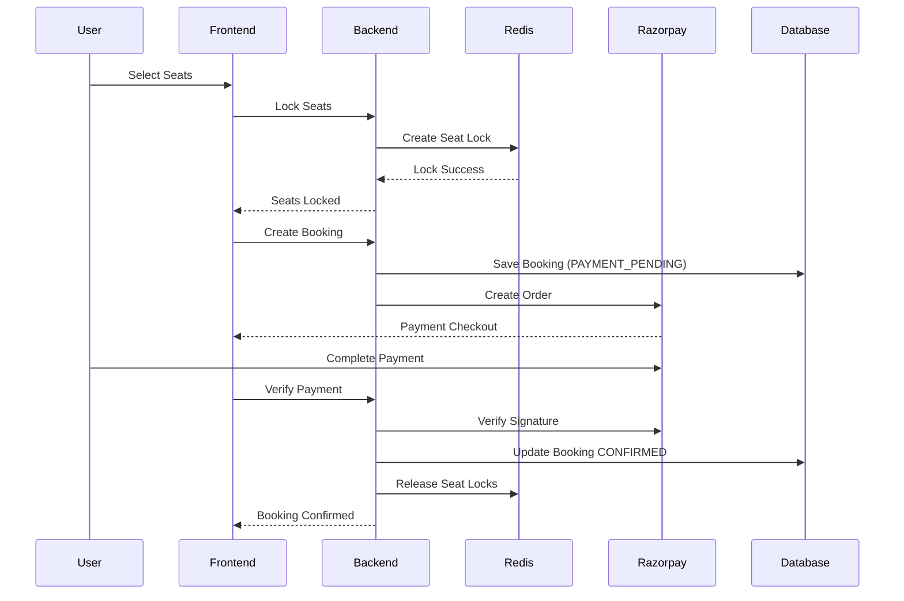

# Booking Flow

The booking system in Sarathi is designed to handle **concurrent seat selection safely**.

Redis seat locks prevent multiple users from booking the same seat simultaneously.

---

# Booking Lifecycle



---

# Seat Locking

Seat locking prevents race conditions.

Process:

1. User selects seats
2. Seats locked in Redis
3. Lock expires after **5 minutes**
4. Booking must complete within this time

If payment fails or expires:

* seats become available again.

---

# Booking States

Possible states:

```
PAYMENT_PENDING
CONFIRMED
CANCELLED
PAYMENT_FAILED
```

---

# Idempotency

Each booking includes an **idempotency key**.

Purpose:

Prevent duplicate bookings caused by network retries.

---

# Real-Time Updates

Seat changes are broadcast via WebSocket.

Topic:

```
/topic/seat-updates
```

Events:

* seat locked
* seat released
* seat booked
