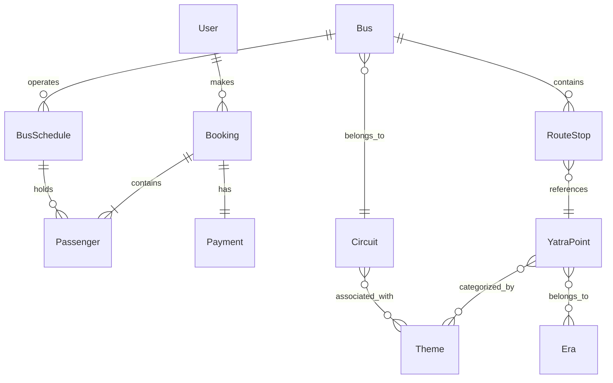

# Domain Model Diagram

The Sarathi platform models **heritage mobility networks** connecting civilizational routes and pilgrimage destinations.

---

## Entity Relationship Diagram



---

# Entity Descriptions

## User

Represents a registered user.

Fields include:

* email
* password
* role

Roles:

```
ROLE_USER
ROLE_ADMIN
```

---

## Bus

Represents a transport route.

Attributes:

* origin
* destination
* seat capacity
* pricing
* schedule references

Each bus belongs to a **Circuit**.

---

## Circuit

Represents a **civilizational travel corridor**.

Examples:

* Sacred River Corridor
* Buddhist Heritage Route
* Temple Architecture Spine

---

## RouteStop

Intermediate stops along a route.

Each stop references a **YatraPoint**.

---

## YatraPoint

A heritage or pilgrimage location.

Attributes:

* name
* coordinates
* cultural metadata
* associated themes

---

## BusSchedule

Represents a specific **travel date** for a bus.

Tracks:

* available seats
* passenger allocations

---

## Booking

Represents a booking transaction.

Includes:

* booking status
* idempotency key
* payment references

---

## Passenger

Each booking may include multiple passengers.

Each passenger occupies **one seat**.

---

## Payment

Stores Razorpay payment confirmation data.
