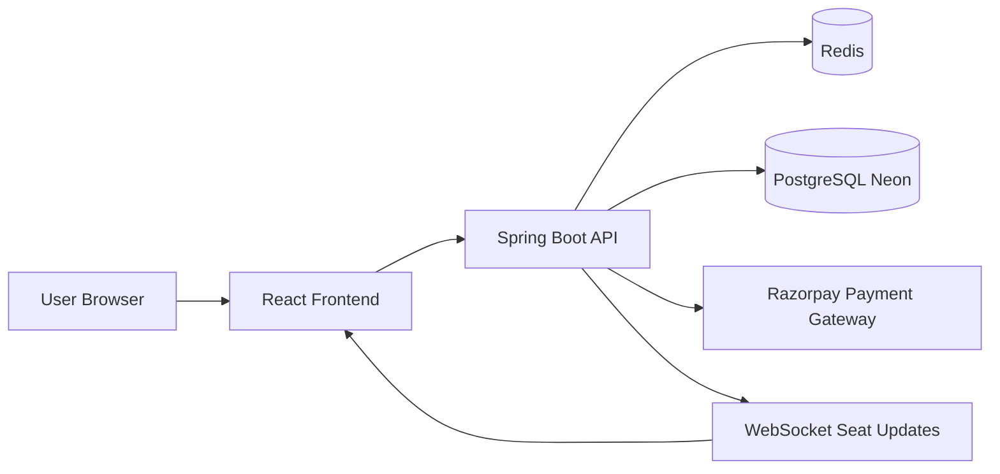

# System Architecture Diagram

This diagram shows the high-level architecture of the Sarathi platform.

Sarathi combines a modern frontend with a scalable backend infrastructure designed for real-time seat management and secure booking workflows.

---

## High-Level System Architecture



---

# Component Responsibilities

## React Frontend

Responsibilities:

* route discovery
* bus search
* seat selection
* real-time seat updates
* payment integration

Technologies:

* React
* WebSocket
* Razorpay Checkout
* Map rendering

---

## Spring Boot Backend

Handles:

* authentication
* bus search
* booking lifecycle
* seat locking
* payment verification

Major modules:

```
controller
service
repository
security
```

---

## Redis

Used for:

* seat locking
* temporary booking state
* caching

Seat locks automatically expire after **5 minutes**.

---

## PostgreSQL (Neon)

Stores:

* buses
* schedules
* circuits
* yatra points
* bookings
* payments

Indexes ensure fast query performance.

---

## Razorpay

Handles payment processing.

Booking confirmation occurs **only after payment verification**.

---

## WebSocket

Provides **real-time seat updates**.

Topic:

```
/topic/seat-updates
```

Clients subscribed to this topic receive:

* seat locked
* seat released
* seat booked
